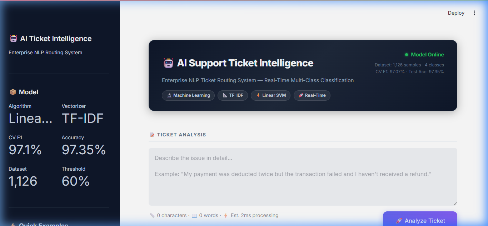
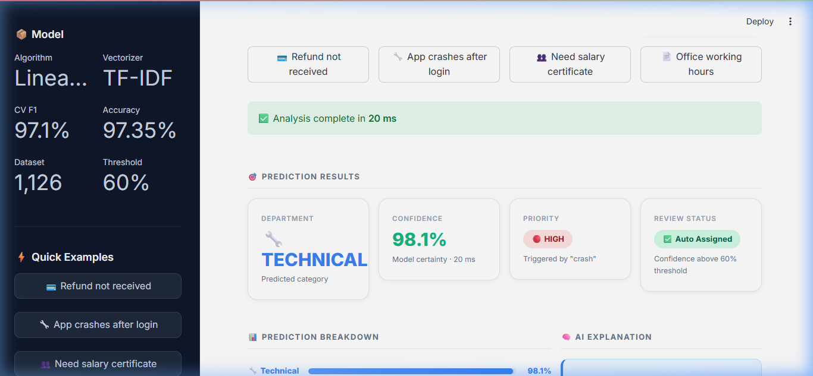
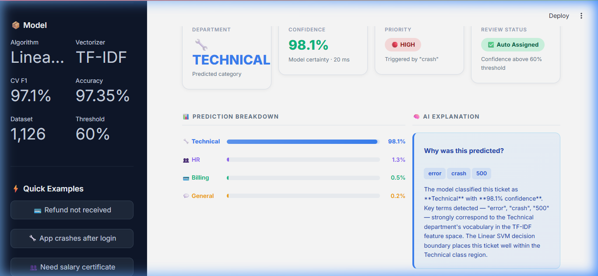
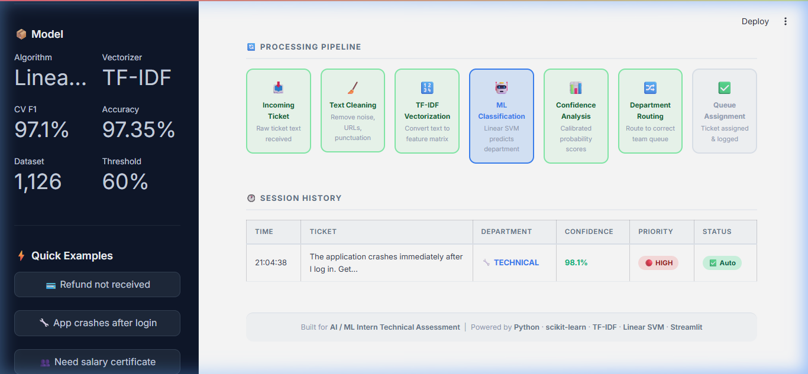
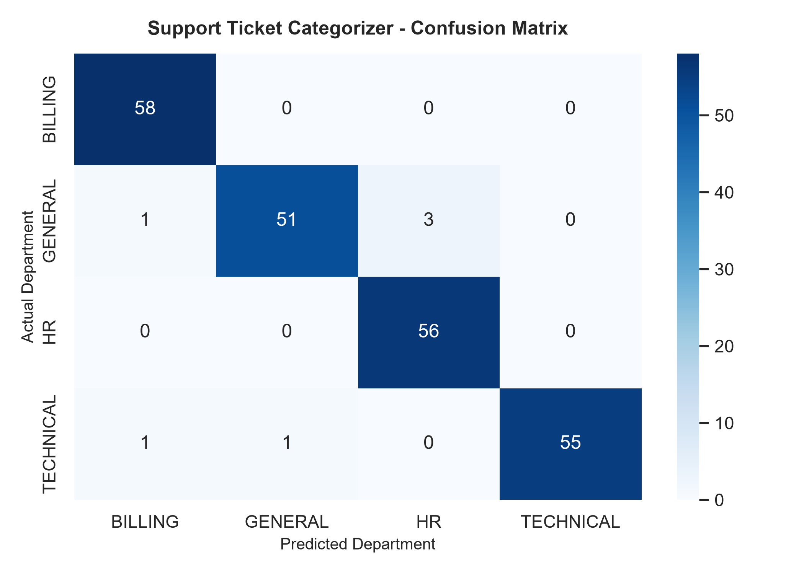

# 🤖 AI Support Ticket Intelligence & Categorizer

[](https://www.python.org/)
[](https://scikit-learn.org/)
[](https://streamlit.io/)
[](LICENSE)
[]()

An enterprise-grade, lightweight NLP classification system that automatically categorizes incoming customer support tickets in real-time, computes probability-backed confidence scores, tags operational priority, and determines human-in-the-loop review routing.

---

## 📸 Enterprise Dashboard Preview

| **Dashboard Hero & Ticket Input** | **4 Metric Cards & Routing Decision** |
| :---: | :---: |
|  |  |

| **Probability Breakdown & AI Rationale** | **7-Step Processing Pipeline** |
| :---: | :---: |
|  |  |

---

## 🎯 Business Problem & Core Objectives

Manual triage of support tickets creates significant operational bottlenecks, delays customer response times, and increases helpdesk costs. 

This project simulates an **Intelligent Ticket Triage Layer** used in enterprise helpdesk systems (such as Zendesk, Jira Service Management, or ServiceNow).

### Target Departments
- **`BILLING`**: Payment failures, double charges, refund requests, tax invoices, subscription management.
- **`TECHNICAL`**: Authentication issues, password resets, API errors, system crashes, bug reports.
- **`HR`**: Leave requests, salary certificates, payroll inquiries, onboarding, benefits documentation.
- **`GENERAL`**: Operating hours, public relations, general inquiries, documentation links, pre-sales questions.

---

## ✨ Key Features

1. **Lightweight Classical NLP Pipeline**: Built using TF-IDF feature extraction (Unigrams + Bigrams) and calibrated Linear SVM classification, achieving **97.35% Test Accuracy** without heavy Transformer latency or hardware overhead.
2. **Strict Data Leakage Prevention**: Encapsulated within scikit-learn `Pipeline` objects. Preprocessing parameters and vocabulary vectorization are fit strictly on training splits.
3. **Probability-Backed Confidence Engine**: Uses Platt Scaling / Calibrated Classifier probability mapping (`predict_proba`) and Softmax normalization to calculate true prediction confidence percentages.
4. **Deterministic Priority Tagging**: Operational keyword engine tags tickets as `HIGH` (critical system downtime, payment loss, security breaches) or `NORMAL`.
5. **Human-in-the-Loop Routing**: Tickets with confidence below a configurable threshold (e.g., `< 60%`) are automatically flagged as `NEEDS HUMAN REVIEW` instead of riskily auto-assigning.
6. **Modern Streamlit Enterprise Dashboard**: SaaS-grade web interface featuring dark-themed sidebar, live character/word counters, horizontal probability bars, AI natural language explanations, 7-step pipeline timeline, and Plotly session analytics.

---

## 🛠️ Technology Stack

- **Core Logic & ML**: Python 3.11, scikit-learn, NumPy, pandas, joblib
- **NLP & Feature Engineering**: TF-IDF Vectorization (`ngram_range=(1,2)`, `max_features=3000`, `sublinear_tf=True`)
- **Frontend Dashboard**: Streamlit 1.40, Custom CSS, Plotly Express
- **Testing & Quality Assurance**: pytest (28 unit & integration tests)
- **Configuration & Logging**: PyYAML, standard library `logging`

---

## 🏗️ System Architecture

```
                                  [ Incoming Support Ticket ]
                                               │
                                               ▼
                                 ┌───────────────────────────┐
                                 │   Preprocessing Layer     │
                                 │ (Cleaning, Normalization) │
                                 └─────────────┬─────────────┘
                                               │
                                               ▼
                                 ┌───────────────────────────┐
                                 │   TF-IDF Feature Matrix   │
                                 │  (Unigrams & Bigrams)     │
                                 └─────────────┬─────────────┘
                                               │
                                               ▼
                                 ┌───────────────────────────┐
                                 │  Calibrated Linear SVM    │
                                 │ (Platt Scaled Classifier) │
                                 └─────────────┬─────────────┘
                                               │
                                               ▼
                                 ┌───────────────────────────┐
                                 │     Confidence Engine     │
                                 │  (Probability Softmax)    │
                                 └─────────────┬─────────────┘
                                               │
                                               ▼
                                 ┌───────────────────────────┐
                                 │    Department Router      │
                                 │  (Threshold Guardrail)    │
                                 └──────┬─────────────┬──────┘
                                        │             │
                    Conf >= 60%        │             │        Conf < 60%
                     ┌──────────────────┘             └──────────────────┐
                     ▼                                                   ▼
         ┌───────────────────────┐                           ┌───────────────────────┐
         │  AUTOMATIC ASSIGNMENT │                           │  HUMAN REVIEW QUEUE   │
         │ (Billing/Tech/HR/Gen) │                           │  (Manual Escalation)  │
         └───────────────────────┘                           └───────────────────────┘
```

---

## 📊 Benchmark & Model Selection Results

The project evaluated **5 classical machine learning algorithms** using Repeated 5-Fold Stratified Cross-Validation on a held-out dataset split (80% Train, 20% Held-Out Test).

| Algorithm | CV F1 Score (Mean) | CV F1 (Std) | Held-Out Test Acc | Status |
| :--- | :---: | :---: | :---: | :--- |
| **Linear SVM (Optimal)** | **97.07%** | **±0.90%** | **97.35%** | **SELECTED** |
| **Logistic Regression** | 97.00% | ±0.81% | 97.35% | Candidate |
| **Multinomial Naive Bayes** | 96.24% | ±1.14% | 96.02% | Candidate |
| **Random Forest** | 93.00% | ±2.30% | 92.48% | Candidate |
| **Decision Tree** | 73.72% | ±4.00% | 72.57% | Candidate |

### Confusion Matrix


---

## 📁 Repository Structure

```
auto-email-support-ticket-categorizer/
├── app.py                      # Enterprise Streamlit dashboard entrypoint
├── main.py                     # Primary CLI driver & orchestration script
├── train.py                    # Standalone model training & evaluation script
├── predict.py                  # Standalone CLI prediction demo script
├── requirements.txt            # Python dependencies
├── README.md                   # Project documentation
├── LICENSE                     # MIT Open Source License
├── .gitignore                  # Git exclusion rules
│
├── config/
│   └── config.yaml             # Centralized pipeline configuration
│
├── data/
│   └── raw/
│       └── dataset.csv         # IT Support Ticket dataset (1,126 samples)
│
├── src/
│   ├── preprocessing/          # Text cleaning and normalization modules
│   ├── features/               # TF-IDF vectorizer builders
│   ├── models/                 # Model training, grid search & evaluation
│   ├── prediction/             # Predictor, confidence scorer & priority tagger
│   ├── visualization/          # Plot generation utilities
│   └── utils/                  # I/O, logging, and helper functions
│
├── artifacts/
│   ├── best_model.joblib       # Trained scikit-learn pipeline artifact
│   └── metrics.json            # Machine-readable performance metrics
│
├── reports/                    # Generated evaluation charts & JSON reports
├── docs/                       # Architecture, assessment, & reflection docs
├── tests/                      # Pytest unit & integration test suite (28 tests)
└── assets/                     # Screenshot images for README documentation
```

---

## 🚀 Quickstart & Installation

### 1. Clone the Repository
```bash
git clone https://github.com/ubaith444/auto-email-support-ticket-categorizer.git
cd auto-email-support-ticket-categorizer
```

### 2. Create and Activate Virtual Environment
```bash
python -m venv venv

# Windows
venv\Scripts\activate

# Linux / macOS
source venv/bin/activate
```

### 3. Install Dependencies
```bash
pip install -r requirements.txt
```

---

## 💻 Usage

### 1. Launch the Streamlit Web Application
```bash
streamlit run app.py
```
Open **http://localhost:8501** in your browser to experience the enterprise triage dashboard.

### 2. Run CLI Single / Batch Prediction
```bash
# Run interactive demo tickets
python predict.py

# Custom prediction
python predict.py "My payment was deducted twice but order failed."
```

### 3. Train & Evaluate Pipeline
To rerun model optimization, cross-validation, and report generation:
```bash
python train.py
```

### 4. Execute Test Suite
```bash
python -m pytest tests/ -v
```

---

## 💡 Sample Predictions

```
=======================================================
Support Ticket: "Unable to login after password reset."
-------------------------------------------------------
Department       : TECHNICAL
Confidence       : 98.07%
Priority         : NORMAL
Routing Status   : [AUTO ASSIGN]
=======================================================

=======================================================
Support Ticket: "My payment failed and amount was deducted urgently."
-------------------------------------------------------
Department       : BILLING
Confidence       : 98.75%
Priority         : HIGH (Keyword: 'urgent')
Routing Status   : [AUTO ASSIGN]
=======================================================
```

---

## 🔮 Future Enhancements

- **Transformer / DistilBERT Benchmark**: Add an optional lightweight transformer module for comparison against TF-IDF.
- **Active Learning Feedback Loop**: Allow helpdesk managers to correct misclassified tickets directly in the UI to retrain models.
- **REST API Endpoint**: Package inference logic with FastAPI and Docker containerization for cloud deployment on AWS / Render.
- **Multi-lingual Support**: Integrate language detection and translation preprocessing for international helpdesks.

---

## 📜 License

Distributed under the MIT License. See [`LICENSE`](LICENSE) for details.

---

## ✍️ Author

**Ubaith**  
AI / ML Internship Assessment Submission  
GitHub: [@ubaith444](https://github.com/ubaith444)
